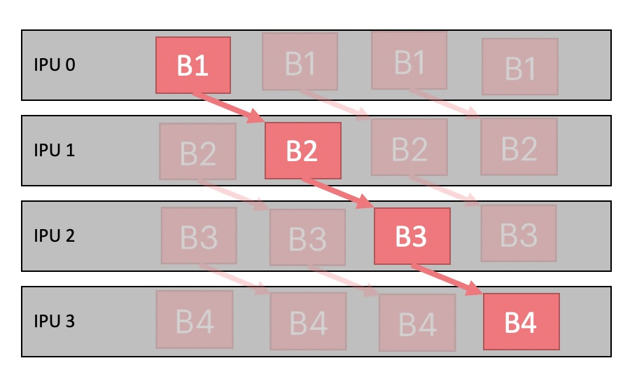

.. _efficient_data_batching:

=======================
Efficient data batching
=======================

By default PopTorch will process the ``batch_size`` which you provided to
the :py:class:`poptorch.DataLoader`.

When using the other options below, the actual number of samples used per step
varies to allow the IPU(s) to process data more efficiently.

However, the effective (mini-)batch size for operations which depend on it (such
as batch normalization) will not change. All that changes is how much data is
actually sent for a single step.

.. note:: Failure to use :py:class:`poptorch.DataLoader` may result in
   accidentally changing the effective batch size for operations which depend on
   it, such as batch normalization.

poptorch.DataLoader
===================

If you set the ``DataLoader`` ``batch_size`` to more than 1 then each operation
in the model will process that number of elements at any given time.

.. autoclass:: poptorch.DataLoader
   :special-members: __init__
   :members: terminate

poptorch.AsynchronousDataAccessor
=================================

To reduce host overhead you can offload the data loading process to a
separate thread by specifying `mode=poptorch.DataLoaderMode.Async` in the
:py:class:`~poptorch.DataLoader` constructor. Internally this uses an
:py:class:`~poptorch.AsynchronousDataAccessor`. Doing this allows you to reduce
the host/IPU communication overhead by using the time that the IPU is running
to load the next batch on the CPU. This means that when the IPU is finished
executing and returns to host the data will be ready for the IPU to pull in again.

.. autoclass:: poptorch.AsynchronousDataAccessor
   :special-members: __init__, __len__
   :members: terminate

Example
-------

.. literalinclude:: device_iterations.py
  :caption: Use of AsynchronousDataAccessor
  :start-after: data_accessor_start
  :end-before: data_accessor_end
  :emphasize-lines: 10
  :linenos:

poptorch.Options.deviceIterations
=================================

If you set :py:meth:`~poptorch.Options.deviceIterations` to more
than 1 then you are telling PopART to execute that many batches in sequence.

Essentially, it is the equivalent of launching the IPU in a loop over that
number of batches. This is efficient because that loop runs on the IPU
directly.

Example
-------

.. literalinclude:: device_iterations.py
  :caption: Use of device iterations and batch size
  :start-after: iterations_start
  :end-before: iterations_end
  :emphasize-lines: 52, 58
  :linenos:

poptorch.Options.replicationFactor
==================================

:py:meth:`~poptorch.Options.replicationFactor` will replicate the model over N
IPUs to allow automatic data parallelism across many IPUs.

.. literalinclude:: device_iterations.py
  :caption: Use of replication factor
  :start-after: replication_start
  :end-before: replication_end
  :emphasize-lines: 8
  :linenos:

.. _gradient_accumulation:

poptorch.Options.Training.gradientAccumulation
==============================================

You need to use
:py:meth:`~poptorch.options._TrainingOptions.gradientAccumulation`
when training with pipelined models because the weights are shared across
pipeline batches so gradients will be both updated and used by subsequent
batches out of order.
Note :py:meth:`~poptorch.options._TrainingOptions.gradientAccumulation`
is only needed by :py:class:`poptorch.PipelinedExecution`.

See also :py:class:`poptorch.Block`.

.. literalinclude:: device_iterations.py
  :caption: Use of gradient accumulation
  :start-after: gradient_acc_start
  :end-before: gradient_acc_end
  :emphasize-lines: 8
  :linenos:

Example with parallel execution
-------------------------------

In the code example below, :py:class:`poptorch.Block` introduced in
:ref:`parallel_execution` is used to divide up
a different model into disjoint subsets of layers.
These blocks can be shared among multiple parallel execution strategies.

.. literalinclude:: mnist.py
  :language: python
  :linenos:
  :start-after: annotations_start
  :end-before: annotations_end
  :emphasize-lines: 12, 14, 16, 18, 34
  :caption: A training model making use of :py:class:`poptorch.Block`

You can see the code examples of :py:class:`poptorch.SerialPhasedExecution`,
:py:class:`poptorch.PipelinedExecution`, and
:py:class:`poptorch.ShardedExecution` below.
Espeially a strategy of :py:class:`poptorch.PipelinedExecution`
is created to assign
layers to multiple IPUs as a pipeline.
Gradient accumulation is used to push multiple
batches through the pipeline allowing IPUs to run in parallel.

.. literalinclude:: mnist.py
  :caption: An example of different parallel execution strategies
  :language: python
  :linenos:
  :start-after: annotations_strategy_start
  :end-before: annotations_strategy_end
  :emphasize-lines: 6, 13, 19, 21

:numref:`figPipeline` shows the pipeline execution for multiple batches
on IPUs. There are 4 pipeline stages running on 4 IPUs respectively.
Gradient accumulation enables us to keep the same number of pipeline stages,
but with a wider pipeline.
This helps hide the latency, which is the total time for one item to go
through the whole system, as highlighted.

.. _figPipeline:

   Pipeline execution with gradient accumulation
