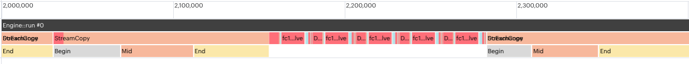
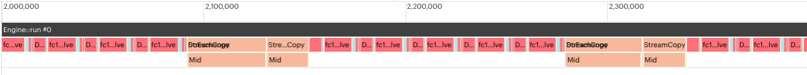
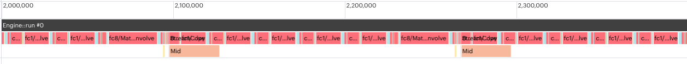

=====================
Efficient IPU I/O
=====================

When developing applications for the IPU, maximising I/O performance is
important. If an application is still I/O-bound after optimising host data
loading, then you can explore further optimisations of the movement of data
into the IPU. This chapter will cover two specific optimisations that can
improve I/O performance:

* prefetch and multibuffering
* overlapping compute and I/O

Prefetch and Multibuffering
===========================

Poplar supports prefetching and multibuffering to improve I/O performance.
For more details, see `'Optimising host data transfers' in the Poplar and PopLibs User Guide <https://docs.graphcore.ai/projects/poplar-user-guide/en/latest/poplar_programs.html#optimising-host-data-transfers>`__.

Prefetch is enabled by default in Poplar. The default buffer depth is 1. You
can increase the value for the buffer depth to improve I/O performance:

.. code-block:: python

    opts = poptorch.Options()
    opts._Popart.set("defaultPrefetchBufferingDepth", 3)

Using multibuffering is especially useful when you see large ``StreamCopyBegin``
or ``StreamCopyEnd`` phases in your application's profile.

For example, :numref:`figNoBuffering` shows a profile of a simple program
without using buffering. The program consists of a loop where the IPU gets data
from the host, processes it and sends the result back. The ``StreamCopy``,
in light orange represents the data transfer. The first one is the host to IPU
transfer, the second one is the IPU to host transfer. They are split into a
``Begin``, a ``Mid``, and an ``End`` phase. In the ``Begin`` and ``End`` phases,
the IPU waits for the host to become ready. In the ``Mid`` phase the IPU
performs the transfer. Between the ``StreamCopy`` operations are the compute
steps, shown in red. In this profile, you can see the IPU is waiting for data
from the host for a significant amount of time.

  Profile with multibuffering disabled

:numref:`figWithBuffering` shows the profile of the same program with
buffering. You can see that the IPU no longer waits for the host: the ``Begin``
and ``End`` section of the ``StreamCopy`` are gone.

  Profile with multibuffering enabled and related improvements

Overlapping compute and I/O
===========================

To optimise I/O further, you can choose to dedicate a specified number of tiles
to communication and leave the rest of the tiles for compute. Computation
time will be adversely affected by having access to fewer tiles, so there is a
tradeoff between optimising I/O and optimising compute here.

To overlap compute and I/O:

#. In PopTorch's ``Options``, you must specify the number of I/O tiles and
   select one of ``ShardedExecution``, ``ParallelPhasedExecution`` or
   ``SerialPhasedExecution`` as the ``ExecutionStrategy``:

    .. code-block:: python

        opts.TensorLocations.numIOTiles(64)
        opts.setExecutionStrategy(poptorch.ShardedExecution())

#. In the forward method of the model, you must set the ``OverlapMode``
   for the inputs and outputs of the model to ``OverlapDeviceIterationLoop``, as
   follows:

    .. code-block:: python

        def forward(self, x):
          x = poptorch.set_overlap_for_input(x, poptorch.OverlapMode.OverlapDeviceIterationLoop)
          x = some_compute(x)
          x = poptorch.set_overlap_for_output(x, poptorch.OverlapMode.OverlapDeviceIterationLoop)
          return x

:numref:`figWithBufferingOverlap` shows the profile of our simple program with
both compute I/O overlap and multibuffering enabled. The compute (in red) and
the I/O (in orange) are stacked on top of each other since they both happen at
the same time.

.. _figWithBufferingOverlap:

  Profile with both multibuffering and I/O compute overlap enabled and related improvements
