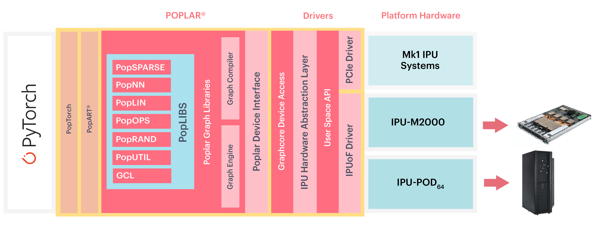

============
Introduction
============

PopTorch is a set of extensions for PyTorch to enable PyTorch models to run directly
on Graphcore IPU hardware. PopTorch has been designed to require as few changes as
possible to your models in order to run on the IPU. However, it does have some
differences from native PyTorch execution, to get the most out of IPU hardware.

See the “Getting Started” guide for your IPU system on the Graphcore
`documentation portal <https://docs.graphcore.ai/>`_ for information on
installing the Poplar SDK and PopTorch.

In the Graphcore software stack, PyTorch sits at the highest level of
abstraction. Poplar and PopLibs provide a software interface to operations
running on the IPU. PopTorch compiles PyTorch models into Poplar executables and
also provides IPU-specific functions.

    PyTorch, PopTorch and the Poplar software stack

PopTorch supports executing native PyTorch models for both inference and training.
To run a PyTorch model on the IPU, you must wrap your model with either:

* :py:func:`poptorch.inferenceModel`
* :py:func:`poptorch.trainingModel`

Both of these functions accept a PyTorch model (`torch.nn.Module <https://pytorch.org/docs/1.7.1/generated/torch.nn.Module.html#torch.nn.Module>`_) and create a
representation of the model that can be executed on the IPU hardware.

In training mode, PopTorch uses its own automatic differentiation engine
(autograd) that differs from native PyTorch.  The input model (`torch.nn.Module <https://pytorch.org/docs/1.7.1/generated/torch.nn.Module.html#torch.nn.Module>`_)
is required to have at least one loss built into the forward pass.  PopTorch
backpropagates the gradients from the loss value(s) to update the model
parameters. This is all taken care of automatically so your training loop does not
need to call ``.backward()`` on the loss value(s) or ``.step()`` on the optimiser.

The following example shows a typical native PyTorch training loop.  The model
incorporates a loss criterion within the ``.forward()`` method, and returns the loss
value as a second output (along with the prediction).  This native PyTorch training
loop manually invokes the ``.backward()`` method to backpropagate the gradients.
The loop also manually updates the optimiser by calling the ``.step()`` method.

.. literalinclude:: poptorch_training_simple.py
  :caption: A simple example of training using PyTorch on the CPU
  :linenos:
  :start-after: simple_cpu_start
  :end-before: simple_cpu_end

Data batching
=============

An equivalent training loop executing the model on the IPU with PopTorch is shown
below. The :py:class:`poptorch.DataLoader` is used to efficiently load data batches
on the IPU.  PopTorch follows the data batching semantics of PopART. By default,
this means you will just pass in data of the normal batch size. However, there are a
number of options provided in PopTorch which will enable more efficient data
loading. See :numref:`efficient_data_batching` for more information.

Notice that the `torch.optim.AdamW <https://pytorch.org/docs/1.7.1/optim.html#torch.optim.AdamW>`_ optimiser is passed as an input argument to the
:py:func:`poptorch.trainingModel` wrapper which applies the optimiser algorithm
during training on the IPU.  The optimiser state is automatically managed by the
PopART framework so there is no need to call the ``.step()`` method.  Another
significant change from the native training loop is there is no ``loss.backward()``.
As mentioned above, PopTorch uses its own automatic differentiation engine and will
detect the loss value to backpropagate the gradients from.

.. literalinclude:: poptorch_training_simple.py
  :caption: Equivalent code using PopTorch to train on the IPU
  :linenos:
  :start-after: simple_ipu_start
  :end-before: simple_ipu_end

Parallel and Distributed execution
==================================

To scale your models, you can enable :ref:`parallel_execution` using
PopTorch's :ref:`annotation_tools` to label or wrap individual parts of your
model and assign parts of the model to an individual IPU or execution phase.
You can also use PopTorch's :ref:`execution_strategies` to determine how the
model executes the phases.

Having assigned the model to run on one or more IPUs, you can add additional
parallelism through replication. Each replica represents an addition copy of the
entire model, which runs in parallel.

PopTorch can also run across multiple hosts. This is necessary for using more
than 64 IPUs across IPU-PODs and may be beneficial when using a smaller number
of IPUs such as models involving intensive pre-processing on the CPU. We
recommend using the PopRun command-line tool and and PopDist configuration
library, which can automatically set up PopTorch to run across multiple
IPU-POD hosts. Please refer to the `PopRun an PopDist user guide <https://docs.graphcore.ai/projects/poprun-user-guide/>`_.

Constraints
===========

PopTorch uses PyTorch's `torch.jit.trace <https://pytorch.org/docs/1.7.1/generated/torch.jit.trace.html#torch.jit.trace>`_ API. That means it inherits the
constraints of that API. These include:

   * Inputs must be PyTorch tensors or tuples containing PyTorch tensors.
   * ``None`` can be used as a default value for a parameter but cannot be
     explicitly passed as an input value.
   * `torch.jit.trace <https://pytorch.org/docs/1.7.1/generated/torch.jit.trace.html#torch.jit.trace>`_ cannot handle control flow or shape variations within the
     model. That is, the inputs passed at run-time cannot vary the control flow of the
     model or the shapes/sizes of results. If you attempt this, the graph will be
     frozen to whichever control flow path was traced as a result of the first inputs
     given to the wrapped model.

.. note:: All tensor data types and shapes must be constant for the entire dataset.

Not all PyTorch operations have been implemented by the PopTorch compiler yet.  See
:numref:`supported_ops` for a list of operators that are supported on the IPU.
Please also report any unsupported operators to support@graphcore.ai so that these
ops may be incorporated into a future release.

Other resources
===============

Please see Graphcore's website for `How-to Videos <https://www.graphcore.ai/resources/how-to-videos>`_  and `Graphcore's code examples GitHub repository <https://github.com/graphcore/examples>`_ for PopTorch `applications <https://github.com/graphcore/examples/tree/master/applications/pytorch>`_,
`code examples <https://github.com/graphcore/examples/tree/master/code_examples/pytorch>`_ and `tutorials <https://github.com/graphcore/examples/tree/master/tutorials/pytorch>`_.
Further developer resources can be found on `Graphcore's developer portal <https://www.graphcore.ai/developer>`_.
