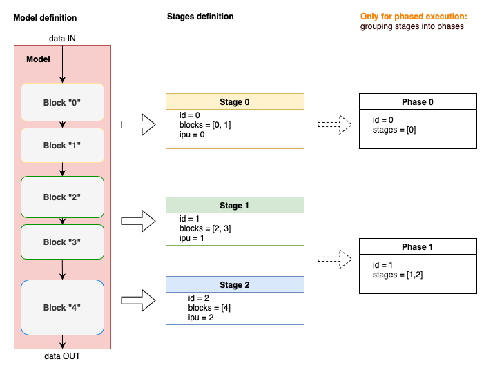

========
Features
========

.. contents::
  :local:
  :depth: 3

Options
=======

You can change how PopTorch compiles and executes models using :py:class:`poptorch.Options`.
You can find a full list of options in :numref:`options`.
Broadly speaking, the options fall into the following categories:

#. General options (see :py:class:`~poptorch.Options`)
#. Options related to half precision (see :py:class:`opts.Precision.* <poptorch.options._PrecisionOptions>`)
#. Management of the training process (see :py:class:`opts.Training.* <poptorch.options._TrainingOptions>`)
#. Location of tensors (see: :py:class:`opts.TensorLocations.* <poptorch.options._TensorLocationOptions>` and
   :py:class:`~poptorch.TensorLocationSettings`)
#. Options relevant to the Torch JIT compiler
   (see :py:class:`opts.Jit.* <poptorch.options._JitOptions>`)
#. Control of distributed execution environments when using tools other than
   `PopRun <https://docs.graphcore.ai/projects/poprun-user-guide/>`__
   (see :py:class:`opts.Distributed.* <poptorch.options._DistributedOptions>`)

See :numref:`efficient_data_batching`  for a full
explanation of how ``device_iterations`` greater than 1, ``gradient_accumulation``, and
``replication_factor`` interact with the output and input sizes.

You can choose to use the IPU Model instead of IPU hardware
with the :py:meth:`~poptorch.Options.useIpuModel` option.

Setting options via config file
-------------------------------

In addition to setting these options programmatically, you can also set them in a
config text file by using :py:func:`~poptorch.Options.loadFromFile`.

Each line in the file must contain a single command corresponding to setting an option
in :py:class:`~poptorch.Options`. To set an option within the file, write the command as you
would within a Python script but omit the ``options.`` prefix. For example:

.. literalinclude:: poptorch.conf
    :language: python
    :caption: Example contents of a config file used to set options
    :linenos:

Then, instantiate :py:class:`~poptorch.Options` and call :py:func:`~poptorch.Options.loadFromFile`:

.. literalinclude:: api.py
    :language: python
    :caption: Setting options using a config file named "poptorch.conf"
    :linenos:
    :start-after: conf_load_start
    :end-before: conf_load_end
    :emphasize-lines: 2

Model wrapping functions
========================

The basis of PopTorch integration comes from the two model wrapping functions
described in the following sections.

.. note:: PopTorch makes a shallow copy of the model. Changes to the parameters
    in the models returned by these two model wrapping functions affect the
    original model and vice versa. However, primitive variable types will not be
    kept in sync. This includes the ``training`` bool of ``pytorch.nn.Module``.
    If your PyTorch model is named ``model``, call ``model.eval()`` or
    ``model.train()``, if required, before calling these wrapping functions.

poptorch.trainingModel
----------------------

This function wraps a PyTorch model, yielding a PopTorch model that can
be run on the IPU in training mode. See :py:func:`~poptorch.trainingModel` for
more information.

.. literalinclude:: trainingModel.py
    :language: python
    :caption: An example of the use of trainingModel
    :linenos:
    :emphasize-lines: 22
    :start-after: training_model_start
    :end-before: training_model_end

.. note:: By default, PopTorch will only return the final batch of outputs.
   Please see :numref:`trainingOutputMode` for details on what PopTorch returns
   when using :py:func:`~poptorch.trainingModel` and how you can calculate
   statistics such as training accuracy over all batches.

poptorch.inferenceModel
-----------------------

This function wraps a PyTorch model, yielding a PopTorch model that can
be run on the IPU in inference mode. See :py:func:`~poptorch.inferenceModel` for
more information.

.. literalinclude:: inferenceModel.py
    :language: python
    :caption: An example of the use of inferenceModel
    :linenos:
    :start-after: inference_model_start
    :emphasize-lines: 14

poptorch.PoplarExecutor
-----------------------

You should not create this class directly. It is a wrapper around the model
that was passed into :py:func:`~poptorch.inferenceModel` or :py:func:`~poptorch.trainingModel`.
It has a few methods which you can use to interface with the IPU.

The :py:class:`~poptorch.PoplarExecutor` will implicitly keep in sync the
parameters of the source PyTorch model and the PopTorch model(s). However, you
need to explicitly copy the weights before you run a model on the IPU if you
train the model on the CPU after you have already wrapped it for the IPU. You
also need to explicitly copy the weights if you alter an already wrapped model
parameter by some other means.

See :py:class:`~poptorch.PoplarExecutor` for a complete description of the IPU interface
functionality.

.. literalinclude:: trainingModel.py
    :language: python
    :caption: Example contents of when explicit copies are needed
    :linenos:
    :start-after: explicit_copy_start
    :end-before: explicit_copy_end

poptorch.isRunningOnIpu
-----------------------

One useful utility function is :py:func:`~poptorch.isRunningOnIpu`. This
returns ``True`` when executing on the IPU and ``False`` when executing
the model outside IPU scope. This allows for different code paths within
the model.

A common use case is executing equivalent code to a PopART custom operator
when running on the CPU. For example:

.. code-block:: python

    class Network(torch.nn.Module):
      def forward(self, x, y):
          if poptorch.isRunningOnIpu():
              # IPU path
              return my_custom_operator(x, y)
          else:
              # CPU path
              return my_torch_implementation(x,y)

Error handling
==============

Recoverable runtime errors
--------------------------

This category of error is likely to be transient.

Exception type raised by PopTorch: `poptorch.RecoverableError` (inherits from `poptorch.Error`)

The exception contains the action required to recover from this error in its `recovery_action` string attribute.

This attribute can contain:
 - `IPU_RESET`: Reset the IPU and reload the IPU memory.
 - `PARTITION_RESET`: Reset the IPU partition. This resets the IPU-links between IPUs.
 - `FULL_RESET`: Power cycle the system.

Unrecoverable runtime errors
----------------------------

These errors are likely to persist. You should take the system out of operation for analysis and repair.

Exception type raised by PopTorch: `poptorch.UnrecoverableError` (inherits from `poptorch.Error`)

Application and other errors
----------------------------

This kind of error is due to an error in the program or a misuse of an API.

Exception type raised by PopTorch: `poptorch.Error` if the error was detected in the C++ backend, or some generic Python `Exception` if it happened in the Python layer.

`poptorch.Error` has the following string attributes:
 - `message` The error message without any of the context.
 - `type` The part of the software stack that raised the exception and the category of the error if available.
 - `location` Where the exception was raised.

Example:

.. literalinclude:: error_handling.py
    :language: python
    :linenos:
    :start-after: error_handling_start
    :end-before: error_handling_end
    :caption: How to handle recoverable / unrecoverable errors

.. _execution_strategies:

Multi-IPU execution strategies
==============================

This section describes strategies to run PopTorch code on more than one IPU.
Some of these allow you to run code in parallel on multiple IPUs.
You will need to use one of these execution strategies for PopTorch code that
does not fit on a single IPU.

.. note:: In general, we advise pipelining over as few IPUs as possible.
  However, You may need to experiment to find the optimal pipeline length.
  In some corner cases, a longer pipeline can lead to faster throughput.

There are four kinds of execution strategies that you can use to run a model on a
multi-IPU device:

* :py:class:`~poptorch.PipelinedExecution`
* :py:class:`~poptorch.ShardedExecution`
* :py:class:`~poptorch.SerialPhasedExecution`
* :py:class:`~poptorch.ParallelPhasedExecution`

You can select this with the
:py:func:`~poptorch.Options.setExecutionStrategy` option.

The default execution strategy is :py:class:`~poptorch.PipelinedExecution`.

In the following,
we first introduce the general functions that are relevant to all four
parallel execution strategies.
Finally, we explain the four strategies with examples.

By default, PopTorch will not let you run the model if the number of IPUs is
not a power of 2.
For this reason, it is preferable to annotate the model so that the number of
IPUs used is a power of 2.
However, you can also enable :py:func:`~poptorch.Options.autoRoundNumIPUs` to
automatically round up the number of IPUs reserved to a power of 2, with the
excess being reserved but idle.
This option is not enabled by default to prevent unintentional overbooking of
IPUs.

.. _annotation_tools:

Annotations
-----------

In PopTorch, you can divide a model into blocks. Blocks are associated to stages and
stages can be grouped into phases. This chapter will describe how to define them
and how to use them to set up different execution modes.

:numref:`figStages`

.. _figStages:

   Poptorch model partition summary

Model partitioning using blocks
^^^^^^^^^^^^^^^^^^^^^^^^^^^^^^^

:py:class:`~poptorch.BeginBlock` is a wrapper class, :py:class:`~poptorch.Block`
is a context manager, and :py:func:`~poptorch.BlockFunction` is a function
decorator. These partition models into "blocks" that can be executed on
different IPUs. You can use them to define model sharding on a multi-IPU device.

You can use :py:class:`~poptorch.BeginBlock` to annotate an existing model. Each
call, with example arguments ``(layer_n, ipu_id=m)``, places all layers before
``layer_n`` on IPU ``m-1`` and all layers from ``layer_n`` onwards (inclusive)
on IPU ``m``.

.. literalinclude:: pipeline_simple.py
    :language: python
    :linenos:
    :start-after: annotations_start
    :end-before: annotations_end
    :emphasize-lines: 37-38, 41-42, 45-46
    :caption: Annotating existing layers

You can use :py:class:`~poptorch.Block` to annotate a model from within its
definition. This context manager class defines a scope in the context of
the model. Everything within that scope is placed on the IPU specified (unless
overridden by a :py:class:`~poptorch.Stage`).

.. literalinclude:: pipeline_simple.py
    :language: python
    :linenos:
    :start-after: annotations_inline_start
    :end-before: annotations_inline_end
    :emphasize-lines: 16, 19, 22, 26
    :caption: Annotating a model directly

In addition, you can use the :py:func:`~poptorch.BlockFunction` function decorator
to place functions (containing one or more layers) onto a particular block.
Everything within that function is placed on the IPU specified (unless
overridden by a :py:class:`~poptorch.Stage`)

.. literalinclude:: pipeline_simple.py
    :language: python
    :linenos:
    :start-after: annotations_decorator_start
    :end-before: annotations_decorator_end
    :emphasize-lines: 19, 25
    :caption: Annotating functions

You can use any, or a combination, of these three annotation options.
In the above examples, ``ipu_id`` is used to specify blocks. This alone is
sufficient to enable parallel execution: by default,
:py:class:`~poptorch.AutoStage` will set up a pipeline for which the pipeline
stage is equal to the ``ipu_id`` for each block. However, it would be equally
valid to instead use the ``user_id`` argument to assign names to each block.
Then, using :py:class:`~poptorch.Stage` or :py:class:`~poptorch.Phase` classes,
you can manually assign each block in a pipeline using their names, as outlined
in the next sections.

:py:class:`~poptorch.BeginBlock`, :py:class:`~poptorch.Block` and
:py:func:`~poptorch.BlockFunction`  need to follow a set of rules:

* You must declare all the layers inside a :py:class:`~poptorch.Block` scope
  to avoid missing annotations. :py:class:`~poptorch.BeginBlock`
  doesn't have the same constraint because all the layers called after this will
  automatically be added to the last :py:class:`~poptorch.BeginBlock`.
* Note that PopTorch needs to reserve IPUs in powers of 2. You are
  advised to configure your model accordingly to take full advantage of the IPUs
  available. However, if you need to run with a different number of IPUs, you
  can use ``poptorch.Options().autoRoundNumIPUs(True)`` to allow PopTorch to
  reserve more IPUs than the model specifies.
* You should not include unused or dead layers in any
  :py:class:`~poptorch.BeginBlock` or :py:class:`~poptorch.Block`.
* If layer A happens before layer B inside the model and each layer has
  a :py:class:`~poptorch.BeginBlock` associated with it,
  you need to write :py:class:`~poptorch.BeginBlock` for layer A before
  :py:class:`~poptorch.BeginBlock` for layer B.

Failing to obey above rules will result in compilation errors.

poptorch.Stage and poptorch.AutoStage
^^^^^^^^^^^^^^^^^^^^^^^^^^^^^^^^^^^^^

Conceptually, :py:class:`~poptorch.BeginBlock` and
:py:class:`~poptorch.Block` collect the
layers of a model into a :py:class:`~poptorch.Stage`.
You can combine multiple stages into a :py:class:`~poptorch.Phase`.
Multiple phases form an execution strategy.

poptorch.Stage
""""""""""""""

:py:class:`~poptorch.Stage` defines the layers of the model to run on one IPU.
A stage can consist of one or more blocks created using
:py:class:`~poptorch.BeginBlock` or :py:class:`~poptorch.Block`
and identified by their ``user_id``.

You can define consecutive layers in a model in either the same
stage or consecutive stages.
Whether stages run in parallel or sequentially depends on the specific
execution strategy.

Internally, each operation in a model is assigned a ``stage_id``
through :py:class:`~poptorch.Stage`.

poptorch.AutoStage
""""""""""""""""""

You can use :py:class:`~poptorch.AutoStage` if you don't want to
specify stages by hand.
This will assign one :py:class:`~poptorch.Stage`
per :py:class:`~poptorch.BeginBlock` or :py:class:`~poptorch.Block`.

By default, ``AutoStage.SameAsIpu`` is true, which means the
``stage_id`` of the :py:class:`~poptorch.Stage` will be set to the ``ipu_id``
specified for the :py:class:`~poptorch.BeginBlock` or
:py:class:`~poptorch.Block`.

Note that ``stage_id`` must have ascending values in
:py:class:`~poptorch.PipelinedExecution`.
Let's use the code example above.
If your blocks "0", "1", and "2" are assigned to IPU 0, 1, and 0.
Then the :py:class:`~poptorch.Block`
"2" will be assigned ``stage_id`` 0. This will cause
the compiler to fail to
schedule the last two stages "1" and "2" due to a conflict:

* The model implies "1" should run earlier than "2"
* Their ``stage_id`` values suggest "2" should run earlier than "1"

When ``AutoStage.AutoIncrement`` is true, each new
:py:class:`~poptorch.BeginBlock` or
:py:class:`~poptorch.Block` will be assigned an automatically incremented
``stage_id``.
In the previous example the last stage would be assigned ``stage_id`` 2 and
the compilation would succeed.

poptorch.Phase
^^^^^^^^^^^^^^

:py:class:`~poptorch.Phase` defines a processing unit of phased execution.
It can contain one or more :py:class:`~poptorch.Stage` stages.

:py:class:`~poptorch.Phase` is only used in
:py:class:`~poptorch.SerialPhasedExecution` and
:py:class:`~poptorch.ParallelPhasedExecution`.
It is not used in
:py:class:`~poptorch.ShardedExecution` and
:py:class:`~poptorch.PipelinedExecution`.

.. literalinclude:: phased_execution.py
    :language: python
    :caption: Example of Stage declaration
    :linenos:
    :start-after: stage_start
    :end-before: stage_end

In the code snippet above, "A" and "B" will run in parallel on IPUs 0 and 1
simultaneously because they are placed in two stages. They will run
sequentially on one IPU if they are placed in a single stage.

Advanced annotation with strings
^^^^^^^^^^^^^^^^^^^^^^^^^^^^^^^^

You can use Python strings to represent the ``user_id`` and ``ipu_id`` for a
:py:class:`~poptorch.Block` or
:py:class:`~poptorch.BeginBlock`.
Because strings are evaluated at runtime,
they allow for a dynamic number of stages and phases.

Here is an example showing how to use formatted strings(f-strings) in
:py:class:`~poptorch.ParallelPhasedExecution`.

In :numref:`parallel_phased_example`, there are several places where f-strings are
used:

* Line 25: ``f"phase{phase}_ipu{ipu}"``, where ``phase`` has the values
  0, 1, 1, 2, 3, 3, 4, 5, and 5, and ``ipu`` ranges from 0 to 1.
  The total number of instances for this f-string is 12, from
  6 phases and 2 IPUs.

* Line 32: ``f"phase{N*2-1}_ipu1"``,
  where ``phase`` is 5 and ``ipu`` is 1.

* Lines 46-47 and 50-51: when defining :py:class:`~poptorch.Stage`,
  four f-strings are used where ``n`` ranges from 0 to 2

  * ``f"phase_{2*n}_ipu0"``
  * ``f"phase{2*n}_ipu1"``
  * ``f"phase_{2*n+1}_ipu0"``
  * ``f"phase{2*n+1}_ipu1"``

  These refer to phases 0, 2, 4 and 1, 3, 5, with ``ipu0`` and ``ipu1``,
  respectively.
  So all these 12 f-strings are defined in :py:class:`~poptorch.BeginBlock`,
  and used in :py:class:`~poptorch.Stage` dynamically. These match exactly.

.. literalinclude:: phased_execution.py
  :caption: An example of parallel phased execution
  :language: python
  :linenos:
  :start-after: annotations_start
  :end-before: annotations_end
  :emphasize-lines: 25, 32, 47-48, 51-52
  :name: parallel_phased_example

With the above functions as building blocks, you can set execution strategies
using the four kinds of execution modes, as shown below.

.. _available_execution_strategies:

Available execution strategies
------------------------------

Note that you can use the same annotation for each execution strategy.
They only differ in the method of parallelisation and tensor locations.

Pipelined execution
^^^^^^^^^^^^^^^^^^^

:py:class:`~poptorch.PipelinedExecution` is the default execution strategy.
It extends :ref:`sharded_execution` with parallel execution on multiple
IPUs.

Parallelisation in :py:class:`~poptorch.PipelinedExecution`
requires :py:meth:`~poptorch.Options.deviceIterations` (required for inference
only, but speeds up training) and
:py:meth:`~poptorch.options._TrainingOptions.gradientAccumulation`
(for training only) as explained in :numref:`efficient_data_batching`.
:py:meth:`~poptorch.Options.deviceIterations` must be greater than or equal to
the number of IPUs used by the model.
:py:meth:`~poptorch.options._TrainingOptions.gradientAccumulation` must be
greater than or equal to the number of pipeline stages (forward and backward).
As well as these constraints, you must also consider the batch dimension, which
must be a multiple of
:py:meth:`~poptorch.Options.deviceIterations` *
:py:meth:`~poptorch.Options.replicationFactor` *
:py:meth:`~poptorch.options._TrainingOptions.gradientAccumulation` during
training and :py:meth:`~poptorch.Options.deviceIterations` *
:py:meth:`~poptorch.Options.replicationFactor` during inference.

After one stage has finished processing a batch
on one IPU, it immediately starts processing the next batch.
This creates a pipeline where multiple batches are processed in parallel.

An IPU can only start its own stage of a batch after
its previous stage of the current batch has been processed.
Hence, all IPUs will be occupied after a "warm-up" period.

At the end of processing, a "cool-down" period is required to aggregate the results and apply weight
updates.

Although you only define the :py:class:`~poptorch.Phase` for forward passes,
the corresponding phases for backward passes are also created.

.. _sharded_execution:

Sharded execution
^^^^^^^^^^^^^^^^^

In this strategy, each IPU
will sequentially execute a distinct part of the model.
A single unit of processing :py:class:`~poptorch.ShardedExecution` is called a
shard.

A shard is specified using :py:class:`~poptorch.Stage`,
or if no :py:class:`~poptorch.Stage` is specified,
the ``user_id`` passed by
:py:class:`~poptorch.BeginBlock` or :py:class:`~poptorch.Block` is used.
Each shard is executed sequentially on a single IPU.
You can place multiple shards on multiple IPUs.
However, only one IPU is used at a time, while
the other IPUs are idle.
If an IPU is allocated to run consecutive stages,
PopART will merge consecutive stages into one on the same IPU.
Weights and activations will use the on-chip memory of the IPUs.
You need to place layers that share weights on the same IPU.

:py:class:`~poptorch.ShardedExecution` can be useful
for processing a single sample or for debugging.
Overall, it has low efficiency because only one IPU is used at a time.

Phased execution
^^^^^^^^^^^^^^^^

:py:class:`~poptorch.ParallelPhasedExecution` and
:py:class:`~poptorch.SerialPhasedExecution` have the following
features in common:

* A portion of the weights and activations are transferred to and from
  streaming memory, before and after each phase.
* If the desired weights and activations are already stored in an IPU
  of the same group of IPUs,
  intra-phase cross-IPU copies can replace the copies
  to and from streaming memory.
* This specific portion is needed by the layers of the model wrapped in
  :py:class:`~poptorch.BeginBlock` or :py:class:`~poptorch.Block` in current
  :py:class:`~poptorch.Phase`.
* They both trade off some performance
  for larger models with higher memory needs.
* Any number of phases is allowed.
* The number of stages in each :py:class:`~poptorch.Phase`
  should match the number of IPUs in each group of IPUs.
* Stages inside each :py:class:`~poptorch.Phase` can run in parallel.

Although you only define the :py:class:`~poptorch.Phase` for forward passes,
the corresponding phases for backward passes are also created.
The order of phased execution for backward passes won't change
but you can decide whether a phase is shared by both
forward and backward passes. In other words, you decide whether to avoid
a memory transfer of a portion of the weights and activations.

Serial phased execution
"""""""""""""""""""""""

In :py:class:`~poptorch.SerialPhasedExecution`,
phases execute on a single group of IPUs sequentially.

.. literalinclude:: phased_execution.py
    :language: python
    :caption: How to use SerialPhasedExecution
    :linenos:
    :start-after: serial_start
    :end-before: serial_end

The code above causes all phases to run serially on IPUs 0 and 1.
(A,B and C on IPU 0, A2, B2, C2 on IPU 1).

Parallel phased execution
"""""""""""""""""""""""""

In :py:class:`~poptorch.ParallelPhasedExecution`,
phases are executed in parallel alternating between two groups of IPUs.
Even phases must run on even IPUs and odd phases on odd IPUs.
Inter-phase cross-IPU copies can replace the memory transfers to and from
the streaming memory, if the desired weights and activations are already
available in another group of IPUs.

.. literalinclude:: phased_execution.py
    :language: python
    :caption: How to use ParallelPhasedExecution
    :linenos:
    :start-after: parallel_start
    :end-before: parallel_end

In the code example above, there are three phases. Each phase has two stages
and each IPU group has two IPUs, so the number of groups matches the number
of IPUs. Even phases 0 and 2 run on IPU 0 and 2, while odd phase 1 runs on
IPU 1 and 3. This allows for faster cross-IPU copies, both
inter-phase and intra-phase.

poptorch.Liveness
"""""""""""""""""

:py:class:`~poptorch.Liveness` controls the availability of tensors on IPU,
and is only needed for
:py:class:`~poptorch.ParallelPhasedExecution`
and :py:class:`~poptorch.SerialPhasedExecution`.

The default :py:class:`~poptorch.Liveness` is ``AlwaysLive``.
``OffChipAfterFwd``, ``OffChipAfterFwdNoOverlap`` and
``OffChipAfterEachPhase`` may be helpful if you run a large model
with a tight memory budget.

.. _optimizers:

Optimizers
==========

PopTorch supports the following optimizers:

#. :py:class:`~poptorch.optim.SGD`
#. :py:class:`~poptorch.optim.Adam`
#. :py:class:`~poptorch.optim.AdamW`
#. :py:class:`~poptorch.optim.RMSprop`
#. :py:class:`~poptorch.optim.LAMB`

In addition, PopTorch has features to support float16 models, such as loss scaling, velocity scaling, bias correction and accumulator types.

.. important:: All of these extra attributes (except ``velocity_scaling``) must have the same values for different ``param_groups`` and therefore you must set them at the optimizer level.

.. literalinclude:: api.py
    :language: python
    :caption: How to update values in an Optimizer
    :linenos:
    :start-after: optim_start
    :end-before: optim_end
    :emphasize-lines: 5-9

.. important:: You must call :py:func:`~poptorch.PoplarExecutor.setOptimizer` to apply the new optimizer values to the model.

Loss scaling
------------

When training models which use half/float16 values, you can use loss scaling  to prevent the gradients from becoming too small and underflowing.

Before calculating the gradients, PopTorch will scale the loss by the value of the ``loss_scaling`` parameter.
PopTorch will multiply the gradients by the inverse scale prior to updating the optimizer state.
Therefore, beyond improving numerical stability, neither the training nor the hyper-parameters are affected.

Higher ``loss_scaling`` values can improve numerical stability by minimising underflow.
However, too high a value can result in overflow.
The optimal loss scaling factor depends on the model.

You can either set the ``loss_scaling`` factors manually, or you can set :py:func:`~poptorch.options._TrainingOptions.setAutomaticLossScaling` in :py:class:`opts.Training <poptorch.options._TrainingOptions>`,
which will automatically set a global loss scaling factor. If you both set ``loss_scaling`` manually and enable automatic loss scaling, the manually
set factor(s) will be used initially and updated automatically during training.

.. warning:: Automatic loss scaling is an experimental feature and may not behave as expected.

Velocity scaling (SGD combined variant only)
--------------------------------------------

The SGD optimizer, when used with momentum, updates weights based
on the velocity values.
The combined variant uses one tensor per parameter to store the
velocity and the changes to the velocity from accumulated gradients.
Unlike the separate variant, therefore, each gradient accumulation step involves
adding or subtracting values of a different magnitude to the gradients (for
which loss scaling is used). You can therefore use the ``velocity_scaling`` parameter to scale the combined velocity tensor to improve numerical precision when using half/float16 values.
(Note that the gradients are, in effect, scaled by ``velocity_scaling/loss_scaling`` so the ``loss_scaling`` has no impact on the effective scaling of velocity parameters.)

As with loss scaling, higher values can minimise underflow of the velocity values but may result in overflow.

Accumulation types
------------------

In order to improve numerical stability some of the optimizers (LAMB, Adam, AdamW, RMSprop) give you the option
to tweak the data type used by the optimizer's accumulators.

``accum_type`` lets you choose the type used for gradient accumulation.
``first_order_momentum_accum_type`` / ``second_order_momentum_accum_type`` give you control over the type used to store the first-order and second-order momentum optimizer states.

Constant attributes
-------------------

In order to improve performance and / or save memory PopTorch will try to embed directly in the program the attributes which are constant.

.. important:: Trying to modify a constant attribute after the model has been compiled will result in an error.

For PopTorch optimizers (those from the ``poptorch.optim`` namespace) by default the attributes explicitly passed to the optimizer's constructor will be considered variables and the others will be considered as constant.

You can override this behaviour using :py:func:`~poptorch.optim.VariableAttributes.markAsConstant` and :py:func:`~poptorch.optim.VariableAttributes.markAsVariable` before compiling the model.

.. literalinclude:: api.py
    :language: python
    :caption: Constant and variable attributes for PopTorch optimizers
    :linenos:
    :start-after: optim_const_start
    :end-before: optim_const_end

For native optimizers (those from the `torch.optim <https://pytorch.org/docs/1.10.0/optim.html>`__ namespace) the attributes which are left to their default value in the constructor will be considered to be constant.

There is no method to override this behaviour which is why we recommend you always use the ``poptorch.optim`` optimizers instead.

.. literalinclude:: api.py
    :language: python
    :caption: Constant and variable attributes for Torch optimizers
    :linenos:
    :start-after: torch_optim_const_start
    :end-before: torch_optim_const_end

.. note:: There is an exception: ``lr`` is always marked as variable.

Reading and writing optimizer state
-----------------------------------

When you use a ``poptorch.optim`` optimizer with a :py:func:`~poptorch.trainingModel`, you can use the optimizer's ``state_dict()`` and ``load_state_dict()`` functions to read/write optimizer state to/from the IPU.
This can be used to restart training from a checkpoint saved previously.

.. literalinclude:: api.py
  :caption: Reading and writing optimiser state
  :start-after: optim_state_dict_start
  :end-before: optim_state_dict_end
  :emphasize-lines: 6,11

.. note:: The structure of the state dictionary, as well as the keys within, will differ from those in PyTorch. As such, you cannot load a state dictionary with PopTorch that was obtained by running native PyTorch.

PopTorch ops
============

This section describes some "helper" operations you can use within a model.

poptorch.ctc_beam_search_decoder
--------------------------------

This function adds a Connectionist Temporal Classification (CTC) beam search
decoder operator to the model.

.. literalinclude:: api.py
    :language: python
    :linenos:
    :start-after: ctc_beam_search_start
    :end-before: ctc_beam_search_end
    :emphasize-lines: 3

For more information see: :py:func:`~poptorch.ctc_beam_search_decoder`.

poptorch.ipu_print_tensor
-------------------------

This function adds an op to print the content of a tensor on the IPU.

.. note::
   To prevent the print operation being optimised out by the graph
   optimiser, you must use the return value of ``ipu_print_tensor()``.

.. literalinclude:: api.py
    :language: python
    :linenos:
    :start-after: print_tensor_start
    :end-before: print_tensor_end
    :emphasize-lines: 10

For more information see: :py:func:`~poptorch.ipu_print_tensor`.

poptorch.identity_loss
----------------------

You can use this function to implement custom losses. It takes a single PyTorch tensor
and will backpropagate a gradient of ones through it.

.. literalinclude:: api.py
  :language: python
  :linenos:
  :start-after: identity_start
  :end-before: identity_end
  :emphasize-lines: 5
  :caption: Example of custom loss.

For more information see: :py:func:`~poptorch.identity_loss`.

poptorch.MultiConv
------------------

Use the :py:class:`~poptorch.MultiConv` wrapper class to define multi-convolutions.

Refer to the `PopLibs documentation for multi-convolutions <https://docs.graphcore.ai/projects/poplar-api/en/latest/poplibs_api.html>`__ for further information.

For more information see: :py:class:`~poptorch.MultiConv` and :py:class:`~poptorch.MultiConvPlanType`.

poptorch.nop
------------

PopTorch includes a "no-op" function for debugging purposes.

For more information see: :py:func:`~poptorch.nop`.

poptorch.serializedMatMul
-------------------------

Use this function to create a serialized matrix multiplication, which splits
a larger matrix multiplication into smaller matrix multiplications to reduce
memory requirements.

For more information see: :py:func:`~poptorch.serializedMatMul`.

poptorch.set_available_memory
-----------------------------

Use this function to override the default proportion of tile memory available as
temporary memory for use by operations such as a convolution or matrix
multiplication.  The operators that can be tuned with this setting include:

* convolution
* matrix multiplication
* embedding lookup
* indexing operations

For more information see:

* :py:func:`~poptorch.set_available_memory`
* `technical note <https://docs.graphcore.ai/projects/available-memory/en/latest/>`_ on optimising temporary memory usage

Miscellaneous functions
-----------------------

The following PopTorch functions, not related to model creation, are available:

- :py:func:`~poptorch.ipuHardwareIsAvailable`
- :py:func:`~poptorch.ipuHardwareVersion`
- :py:func:`~poptorch.setLogLevel`

Half / float16 support
=======================

PopTorch supports the half-precision floating point (float16) format.
You can simply input float16 tensors into your model.
(You can convert a tensor to float16 using ``tensor = tensor.half()``)

You can use your models in one of the following ways:

#. Convert all parameters (weights) to float16 by using using a ``Module``'s .``half()`` method. This is the most memory efficient, however small updates to weights may be lost, hindering training.
#. Keep the parameters (weights) as float32, in which case the parameter updates will occur using float32. However, the parameters will be converted to float16 if you call an operation with a float16 input. This is more memory efficient than using float32 tensors (inputs) but less memory efficient than using float16 weights.
#. Use a mix of float32 and float16 parameters by manually specifying parameters as float16 or float32.

.. note::  When PyTorch encounters a mix of float16 and float32 inputs for a given operation, it will usually cast all inputs to float32.
    PopTorch differs and will cast all inputs to float16.
    This makes it easier to build models with float32 weights which take float16 tensors. However, if you wish to follow PyTorch behaviour, you can use  ``opts.Precision.halfFloatCasting(poptorch.HalfFloatCastingBehavior.HalfUpcastToFloat)`` where ``opts`` is the ``poptorch.Options`` object passed to the model wrapping function.

.. literalinclude:: inferenceModel.py
    :language: python
    :caption: How to run a model using half precision
    :linenos:
    :start-after: inference_half_start
    :end-before: inference_half_end
    :emphasize-lines: 1, 2

Because PopTorch relies on the `torch.jit.trace() <https://pytorch.org/docs/1.10.0/generated/torch.jit.trace.html#torch.jit.trace>`__ function, it is limited to tracing operations which run on the CPU.
Many of these operations do not support float16 inputs.
To allow the full range of operations, PopTorch converts all float16 inputs to float32 before tracing and then restores the inputs to float16 as part of the canonicalization process.
Some operations may result in the model running in float32 where float16 would
be expected, or vice versa (see :numref:`float_16_op_support` for full details).

Graphcore's tutorials repository contains a walkthrough on using half and mixed precision
in PopTorch: `Half and mixed precision tutorial <https://github.com/graphcore/tutorials/tree/sdk-release-2.6/tutorials/pytorch/mixed_precision>`_.

Automatic mixed-precision casting
=================================

PopTorch supports converting your model automatically between float16 and float32.
This functionality is not active by default - you must enable it explicitly by
calling the ``autocast(enabled=True)`` method at model level.

.. literalinclude:: autocast.py
    :language: python
    :caption: Enabling automatic casting at model level
    :start-after: model_autocast_start
    :end-before: model_autocast_end
    :emphasize-lines: 2

During compilation, selected layers and operators will have their types adjusted aiming
to strike a good compromise between compute efficiency, memory requirements and numerical
precision.

You can also set automatic casting at the layer level. In this situation,
its effect is hierarchical: changing the setting for a layer affects it and all layers contained
within.

In the following example, automatic casting is enabled for all layers of the model, except for the
first activation and second convolution.

.. literalinclude:: autocast.py
    :language: python
    :caption: Controlling automatic casting at layer level
    :start-after: layer_autocast_start
    :end-before: layer_autocast_end
    :emphasize-lines: 6-8

You can also set automatic casting with the function decorator ``@poptorch.autocast(enabled=True)``.
Its effect is to apply automatic casting to the body of the function. Setting its parameter to ``False``
has the opposite effect. A typical use-case is applying it to the ``forward`` function of custom modules.

.. literalinclude:: autocast.py
    :language: python
    :caption: Controlling automatic casting via decorator
    :start-after: decorator_autocast_start
    :end-before: decorator_autocast_end
    :emphasize-lines: 2

In addition, you can apply ``poptorch.autocast(enabled=True)`` to a code-block, with similar effect.

.. literalinclude:: autocast.py
    :language: python
    :caption: Applying automatic casting to a code-block
    :start-after: block_autocast_start
    :end-before: block_autocast_end
    :emphasize-lines: 3

You can completely turn off this feature for the whole application via the ``autocastEnabled(bool)``
method of :py:class:`~poptorch.options._PrecisionOptions`.

.. literalinclude:: autocast.py
    :language: python
    :caption: Disabling automatic casting
    :start-after: disable_autocast_start
    :end-before: disable_autocast_end
    :emphasize-lines: 2

Custom casting policies
-----------------------

PopTorch provides a mechanism to customize automatic casting behaviour in the form of casting
policy classes. A casting policy is defined by four sets of Torch modules and/or torch operators:

#. ``fp16`` - set of operations to be typed as float16
#. ``fp32`` - set of operations to be typed as float32
#. ``promote`` - set of operations to be promoted to float32 should they take mixed-precision inputs
#. ``demote`` - set of operations to be demoted to float16 should they take mixed-precision inputs

The following example describes a policy where convolution and ReLU operations are to be performed using float16,
whilst batch matrix multiplication is to be performed using float32. Dot product computations will be
promoted to float32 when operands have mixed precision.

.. literalinclude:: autocast.py
    :language: python
    :caption: Custom casting policies
    :start-after: policy_autocast_start
    :end-before: policy_autocast_end
    :emphasize-lines: 5, 8

PyTorch buffers
===============

PopTorch supports PyTorch buffers in some circumstances.
You can use buffers to make tensors persistent,
that is to allow tensors to keep their values from the previous run on each new run,
without making them model parameters.
However, you must make sure that you only make in-place modifications to the
buffer using PyTorch in-place operations (such as `+=` or those ending in  `_`).
For example, you can  ``torch.Tensor.copy_`` to copy the contents of a another
tensor to the buffer.

Unlike when running on the CPU, the following PyTorch code does not increment
``model.i`` each time, when running on the IPU:

.. literalinclude:: buffers.py
    :language: python
    :caption: The wrong way to have a persistent tensor
    :linenos:
    :start-after: counter_model_wrong_start
    :end-before: counter_model_wrong_end

This is because the PyTorch tracer will capture the value for ``model.i`` when
tracing happens and then freeze the value as a constant.
In fact, the value captured is `6.0` as PyTorch has traced or called the
forward method five times before it captures the constant.

You can keep the value of a tensor between runs by registering it as a buffer
in PyTorch, as the following examples shows:

.. literalinclude:: buffers.py
    :language: python
    :caption: An example showing a tensor which is incremented on each iteration by registering it as a tensor.
    :linenos:
    :start-after: counter_model_correct_start
    :end-before: counter_model_correct_end

.. note:: When running an inference model
  (with :py:func:`~poptorch.inferenceModel`), any buffers which your model
  modifies will not be implicitly copied to the host. You will need to call
  :py:func:`~poptorch.PoplarExecutor.copyWeightsToHost` before reading the value
  of a buffer which has been changed as a result of a model call.

.. note:: PopTorch does not support broadcasting of buffers between replicas.
  You can make each replica use its own buffer by setting the PopTorch option
  :py:func:`~poptorch.Options.broadcastBuffers` to False:
  ``poptorch.Options().broadcastBuffers(False)``

  You need to ensure that your model still works with each replica using a
  separate buffer.

.. _creating_custom_ops:

Creating custom ops
===================

If you need to implement functionality that is not directly
supported in in PopTorch, you can create a custom op.

There are two steps to creating a custom op in PopTorch:

#. Implement the op in C++ using the PopART API
#. Make the op available in PopTorch so you can use it in your PyTorch model

Implementing the custom op
--------------------------

You will need to implement the new op as C++ code by creating subclasses of, at
least, the Op and Opx base classes provided by the PopART API.

If you are going to use the custom op for training, then you will also need to
define the classes that implement the gradient operation. For details of how to
do this, see the `Custom operators
<https://docs.graphcore.ai/projects/popart-user-guide/en/latest/custom_ops.html>`__
chapter of the PopART User Guide.

You can find some examples of PopART custom ops in the `Graphcore GitHub tutorials repository
<https://github.com/graphcore/tutorials/tree/sdk-release-2.6/feature_examples/popart/custom_operators>`__.

Compiling the PopART custom op will create a dynamic library file, which you can
use with your PyTorch code.

Make the op available to PyTorch
--------------------------------

After you have compiled the C++ implementation of the custom op, you can load
the library file, and call the op from your PyTorch program, using the
:py:class:`poptorch.custom_op` class.

First, load the dynamic library as shown in :numref:`loading_library_code`.

.. literalinclude:: ../../tests/custom_ops_test.py
    :language: python
    :caption: Loading the library for the custom op
    :linenos:
    :start-after: loading_library_start
    :end-before: loading_library_end
    :name: loading_library_code

You can now call your custom op using the PopTorch class
:py:class:`~poptorch.custom_op`.

Both the forward op and backward op are implemented in the PopART code.
However, in this inference model example, only the forward op is called:

.. literalinclude:: ../../tests/custom_ops_test.py
    :language: python
    :caption: Calling a custom op in a PopTorch inference model
    :linenos:
    :emphasize-lines: 4-8
    :start-after: inference_start
    :end-before: inference_end

In this example ``[x, x]`` is assigned to ``example_outputs``, where ``x``
is one of the input tensors which is used as a template for the output tensors.
The custom op code will need to create the tensors that it returns.

You can also call this custom op inside a training model using
:py:class:`~poptorch.custom_op` and the backward op will be called automatically.

The Graphcore tutorials repository contains a feature example demonstrating
how to load and in and use a custom op in a PopTorch model: `PopTorch example: Custom op <https://github.com/graphcore/tutorials/tree/sdk-release-2.6/feature_examples/pytorch/custom_op>`_.

Passing attributes to the custom op
-----------------------------------

You can pass attributes to the custom op using a Python dictionary, as shown in
:numref:`inference_with_attribute_code`.

.. literalinclude:: ../../tests/custom_ops_test.py
    :language: python
    :caption: Passing an attribute to a custom op from PopTorch
    :linenos:
    :emphasize-lines: 8
    :start-after: inference_with_attribute_start
    :end-before: inference_with_attribute_end
    :name: inference_with_attribute_code

You can then access these attributes within the C++ custom op code. The above
example passes a ``Float`` attribute with the name ``alpha`` to the LeakyRELU
implementation. See the `Custom operators
<https://docs.graphcore.ai/projects/popart-user-guide/en/latest/custom_ops.html>`__
chapter of the PopART User Guide for more information.

Table :numref:`popart-attribute-types` and the code example in
:numref:`many_attribtes_examples_code` show how to pass other attribute types
to a custom op. PopTorch supports all attributes supported in PopART except for
``Graph``.

.. list-table:: Python types to use to pass attributes to PopART
   :widths: 35 65
   :header-rows: 1
   :align: center
   :name: popart-attribute-types

   * - PopART attribute type
     - Python equivalent
   * - ``Float``
     - Python float (converted to float32)
   * - ``Floats``
     - List or tuple of Python float
   * - ``Int``
     - Python int (converted to 64-bit signed int)
   * - ``Ints``
     - List or tuple of Python int
   * - ``String``
     - Python str (converted to ASCII)
   * - ``Strings``
     - List or tuple of Python str
   * - ``Graph``
     - Not supported

.. literalinclude:: ../../tests/custom_ops_attributes_test.py
    :language: python
    :caption: Passing different attribute types from PopTorch
    :linenos:
    :start-after: many_attribtes_examples_start
    :end-before: many_attribtes_examples_end
    :name: many_attribtes_examples_code

Precompilation and caching
==========================

.. _caching:

Caching
-------

By default PopTorch will re-compile the model every time you instantiate a model.
However if you often run the same models you might want to enable executable caching to save time.

You can do this by either setting the ``POPTORCH_CACHE_DIR`` environment variable or by calling :py:class:`~poptorch.Options.enableExecutableCaching`.

.. warning:: The cache directory might grow large quickly because PopTorch doesn't delete old models from the cache and, depending on the number and size of your models and the number of IPUs used, the executables might be quite large. It is your responsibility to delete the unwanted cache files.

Precompilation
--------------

PopTorch supports precompilation: This means you can compile your model on a machine which doesn't have an IPU
and export the executable to a file. You can then reload and execute it on a different machine which does have an IPU.

.. important:: The PopTorch versions on both machines must be an exact match.

To precompile your model you need to wrap it using either :py:func:`~poptorch.trainingModel` or :py:func:`~poptorch.inferenceModel` then call :py:meth:`~poptorch.PoplarExecutor.compileAndExport` on the wrapper.

.. literalinclude:: precompilation.py
    :language: python
    :caption: How to precompile a model using an offline IPU target.
    :linenos:
    :start-after: precomp_start
    :end-before: precomp_end
    :emphasize-lines: 22-23,32

.. note:: If you don't know the IPU version on your system you can use :py:func:`~poptorch.ipuHardwareVersion`.

The exported file by default will contain your original PyTorch model (including the weights), and enough information to re-create the PopTorch wrapper and reload the executable.

.. important:: For your model and weights to be exported, your model must be picklable. See https://docs.python.org/3/library/pickle.html for more information.
  If your model is not picklable then use ``export_model=False``, as shown in :numref:`export_no_python`.

Now both the torch model, PopTorch wrapper and executable can be restored on the target machine using :py:func:`poptorch.load`:

.. literalinclude:: precompilation.py
    :language: python
    :caption: How to load a precompiled model
    :linenos:
    :start-after: load_start
    :end-before: load_end
    :emphasize-lines: 1

In some cases you might want to provide some runtime information to select the device: you can do this
using the ``edit_opts_fn`` argument of :py:func:`poptorch.load`:

.. literalinclude:: precompilation.py
    :language: python
    :caption: How to load a precompiled model and run on a specific IPU
    :linenos:
    :start-after: load_setIpu_start
    :end-before: load_setIpu_end
    :emphasize-lines: 1-2,5

.. note:: When loading a precompiled model, only run-time options will be applied; all others will be ignored.

Going back to the precompilation step: in some cases you might want to export only the
executable and not the python wrapper or torch model (for example if your model cannot be pickled).

.. literalinclude:: precompilation.py
    :language: python
    :caption: How to export only the executable
    :linenos:
    :start-after: precomp_no_python_start
    :end-before: precomp_no_python_end
    :name: export_no_python

It means you will need to re-create and wrap the model yourself before loading the executable:

.. literalinclude:: precompilation.py
    :language: python
    :caption: How to load a precompiled executable
    :linenos:
    :start-after: load_exe_start
    :end-before: load_exe_end
    :emphasize-lines: 1,6-7

.. important:: Exported models lose their connections to other models.

  For example, if you have a :py:func:`poptorch.trainingModel` and a :py:func:`poptorch.inferenceModel` based
  on the same PyTorch model, you wouldn't usually need to keep the weights synchronised between the two;
  PopTorch would take care of it for you, implicitly.

In the following example, PopTorch automatically copies the weights from the training model to the inference model:

.. literalinclude:: precompilation.py
    :language: python
    :caption: PopTorch implicit copies
    :linenos:
    :start-after: implicit_cp_start
    :end-before: implicit_cp_end
    :emphasize-lines: 16,18-20

If you were to export these models:

.. literalinclude:: precompilation.py
    :language: python
    :caption: Precompilation of both a training and validation models
    :linenos:
    :start-after: precomp_train_val_start
    :end-before: precomp_train_val_end
    :emphasize-lines: 11-12,14

.. note:: Don't forget to call ``model.eval()`` or ``model.train()``, as required, before calling :py:func:`~poptorch.PoplarExecutor.compileAndExport`.

You could then insert explicit copy operations:

.. literalinclude:: precompilation.py
    :language: python
    :caption: Precompilation of both a training and validation models
    :linenos:
    :start-after: load_train_val_start
    :end-before: load_train_val_end
    :emphasize-lines: 9,10

Or you would need to re-connect the two models by creating the second one from the first one
and then loading the executable:

.. literalinclude:: precompilation.py
    :language: python
    :caption: Precompilation of both a training and validation models
    :linenos:
    :start-after: load_train_val_connected_start
    :end-before: load_train_val_connected_end
    :emphasize-lines: 2-6

Environment variables
=====================

Logging level
-------------
PopTorch uses the following levels of logging:

  * ``OFF``: No logging
  * ``ERR``: Errors only
  * ``WARN``: Warnings and errors only
  * ``INFO``: Info, warnings and errors (default)
  * ``DEBUG``: Adds some extra debugging information
  * ``TRACE`` and ``TRACE_ALL``: Trace everything inside PopTorch

You can use the ``POPTORCH_LOG_LEVEL`` environment variable to set the logging level:

.. code-block:: bash

  export POPTORCH_LOG_LEVEL=DEBUG

.. _profiling_env:

Profiling
---------

When running programs using PopTorch, you can enable profiling by using the ``POPLAR_ENGINE_OPTIONS`` environment variable used by Poplar.

In order to capture the reports needed for the PopVision Graph Analyser you only need to set ``POPLAR_ENGINE_OPTIONS='{"autoReport.all":"true"}'``:

.. code-block:: bash

  export POPLAR_ENGINE_OPTIONS='{"autoReport.all":"true"}'

By default, report files are output to the current working directory. You can specify a different output directory by setting ``autoReport.directory``, for example:

.. code-block:: bash

  export POPLAR_ENGINE_OPTIONS='{"autoReport.all":"true", "autoReport.directory":"./tommyFlowers"}'

For more options, refer to the `PopVision Graph Analyser User Guide <https://docs.graphcore.ai/projects/graph-analyser-userguide/en/latest/index.html>`__.

In order to capture the ``pvti`` reports needed for the `PopVision System Analyser <https://docs.graphcore.ai/projects/system-analyser-userguide/en/latest/index.html>`__
you need to enable the `PopVision Trace Instrumentation library (PVTI) <https://docs.graphcore.ai/projects/libpvti/en/latest/index.html>`__.
To do so, set ``PVTI_OPTIONS='{"enable":"true"}'``.

.. important:: By default, PopVision will display multiple trace files using relative time. This is because most of the time we want to compare two executions of the same model, for example. However, in this case we want the traces to be aligned on absolute time: this can be done by selecting "Absolute Timing" in the PopVision options.

You can also add extra tracepoints in your own code by using :py:class:`~poptorch.profiling.Channel`.

IPU Model
---------

By default PopTorch will try to attach to a physical IPU.
If instead you want to use the model, you can do so by setting ``POPTORCH_IPU_MODEL`` to ``1``:

.. code-block:: bash

  export POPTORCH_IPU_MODEL=1

See the `Poplar and PopLibs User Guide <https://docs.graphcore.ai/projects/poplar-user-guide>`__ for the limitations of the IPU Model.

Wait for an IPU to become available
-----------------------------------

By default, attempting to attach to an IPU when all IPUs are
already in use will raise an exception.
If you would rather wait for an IPU to become available, you can do so by setting ``POPTORCH_WAIT_FOR_IPU`` to ``1``.

.. code-block:: bash

  export POPTORCH_WAIT_FOR_IPU=1

Enable executable caching
-------------------------

You can enable executable caching by either setting the ``POPTORCH_CACHE_DIR`` environment variable or by calling :py:class:`~poptorch.Options.enableExecutableCaching`.

.. code-block:: bash

  export POPTORCH_CACHE_DIR=/tmp/poptorch_cache

For more information, see :numref:`caching`.
